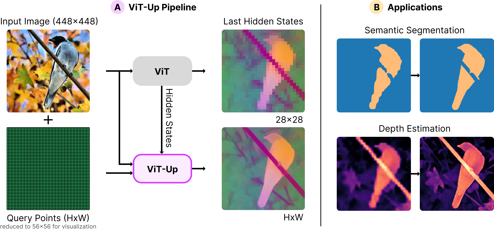

# ViT-Up: Faithful Feature Upsampling for Vision Transformers

ViT-Up upsamples dense Vision Transformer features at arbitrary query
coordinates while preserving the semantic structure of the original backbone
representations. It is designed for high-resolution dense prediction,
correspondence, and probing workflows built on top of DINO-style ViTs.

<p align="center">
  
</p>

<p align="center">
  <a href="#inference">Inference</a> |
  <a href="#training">Training</a> |
  <a href="#evaluation">Evaluation</a>
</p>

Run all commands from the repository root.

## Inference

Try ViT-Up in Google Colab:
[inference_example_colab.ipynb](https://colab.research.google.com/github/krispinwandel/vit-up/blob/main/inference_example_colab.ipynb)

For local usage, see [notebooks/inference_example.ipynb](notebooks/inference_example.ipynb).

### Torch Hub

ViT-Up models can also be loaded directly with `torch.hub.load`. The Hub entry
points download ViT-Up weights from Hugging Face and load the matching DINOv3
backbone.

```python
import torch

device = "cuda" if torch.cuda.is_available() else "cpu"

# Available entry points:
# - vit_up_dinov3_splus
# - vit_up_dinov3_base
model = torch.hub.load(
    "krispinwandel/vit-up",
    "vit_up_dinov3_splus",
    pretrained=True,
    trust_repo=True,
    device=device,
).eval()

images = torch.randn(1, 3, 448, 448, device=device)
query_coords = torch.rand(1, 100, 2, device=device)  # normalized (x, y) in [0, 1]

with torch.no_grad():
    features = model(images, query_coords)

print(features.shape)  # (B, N_queries, D)
```

`pretrained=True` selects the published ViT-Up checkpoint. The Torch Hub entry
points require pretrained weights, so `pretrained=False` is not supported.
`trust_repo=True` tells PyTorch Hub that you trust this repository's `hubconf.py`;
otherwise PyTorch may prompt the first time it loads the repo.

The Hub wrappers accept the same inference options as `ViTUpWrapper`:

```python
model = torch.hub.load(
    "krispinwandel/vit-up",
    "vit_up_dinov3_splus",
    pretrained=True,
    trust_repo=True,
    device="cpu",
    use_bfloat16=False,
    query_chunk_size=4096,
)
```

Set `return_all_layers=True` during the forward pass to get a list of per-layer
feature tensors instead of only the final feature tensor:

```python
all_layer_features = model(images, query_coords, return_all_layers=True)
```

## Training

Train a ViT-Up model with PyTorch Lightning using one of the run configs:

```bash
python main.py fit --config configs/runs/dinov3_splus.yaml
```

For the DINOv3 base variant:

```bash
python main.py fit --config configs/runs/dinov3_base.yaml
```

The run config defines the backbone, query embedding, ViT-Up blocks, optimizer,
data paths, logging, and checkpointing.

### Ablations

```bash
ABLATION_COMMON="--config configs/runs/dinov3_splus.yaml --config configs/runs/ablations/schedule.yaml"
```

```bash
python main.py fit ${ABLATION_COMMON} --config configs/runs/ablations/...
```

## Evaluation

The evaluation kits use Hydra configs under `vit_up/eval_kits/config`.
The examples below evaluate the DINOv3 S+ ViT-Up model. Replace
`dinov3/splus/vit_up` with `dinov3/base/vit_up` for the base model.

Outputs are written under the configured `mnt_dir` output folder. Override it
from the command line if your datasets or output root live elsewhere:

```bash
python <eval_script>.py model=dinov3/splus/vit_up mnt_dir=/path/to/eval_root
```

### Download Datasets

```bash
python scripts/download_datasets.py
```

### Linear Probing

Train a segmentation probing head on VOC:

```bash
python vit_up/eval_kits/probing_toolkit/run_probing.py schedule/mode=train schedule/dataset=voc model=dinov3/splus/vit_up
```

Evaluate a trained or configured probing head:

```bash
python vit_up/eval_kits/probing_toolkit/run_probing.py schedule/mode=eval schedule/dataset=voc model=dinov3/splus/vit_up
```

### Semantic Correspondence

Run the 2D semantic correspondence benchmark:

```bash
python vit_up/eval_kits/correspondence_2d_toolkit/run_correspondence_2d.py model=dinov3/splus/vit_up
```

### Geometric Correspondence

Run NAVI geometric correspondence:

```bash
python vit_up/eval_kits/geometric_correspondence_toolkit/evaluate_navi_correspondence.py model=dinov3/splus/vit_up
```

### Runtime

Benchmark runtime and memory over the configured output resolutions:

```bash
python vit_up/eval_kits/runtime_toolkit/run_runtime_bench.py model=dinov3/splus/vit_up
```

To only print model parameter counts:

```bash
python vit_up/eval_kits/runtime_toolkit/run_runtime_bench.py model=dinov3/splus/vit_up print_model_params_only=true
```
