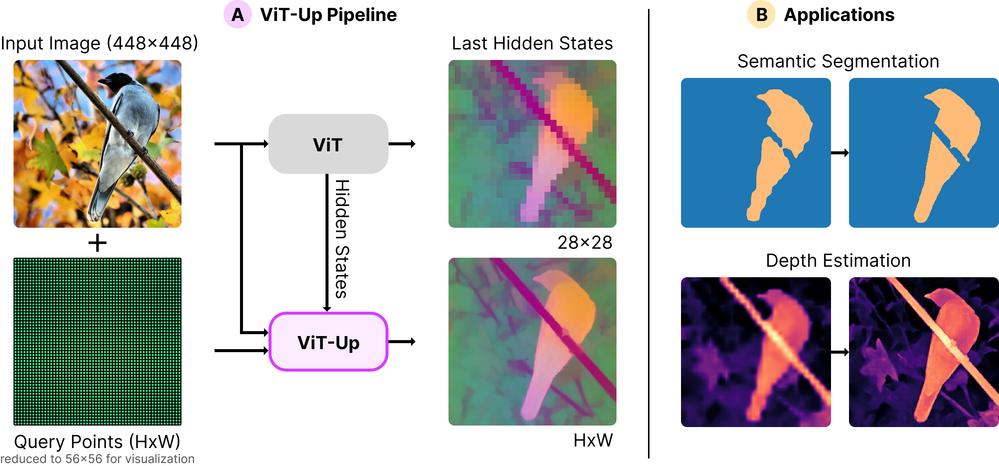
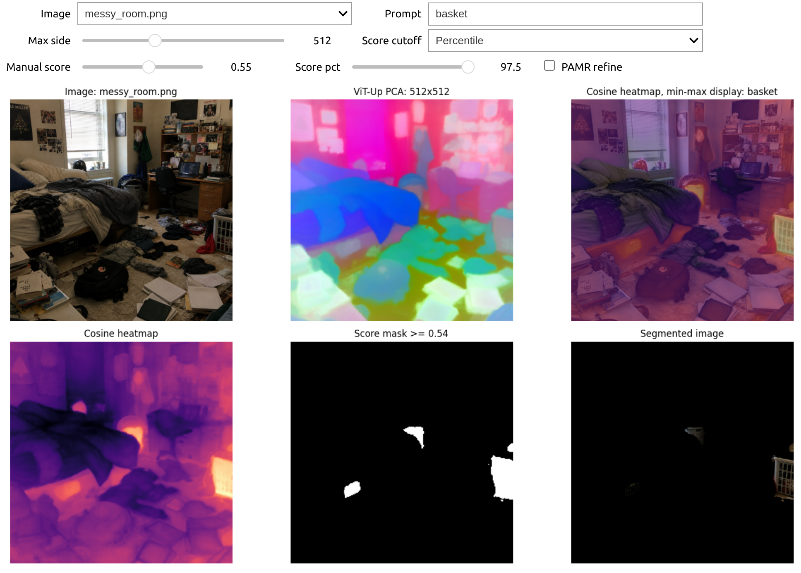

# ViT-Up: Faithful Feature Upsampling for Vision Transformers

<p align="center">
  <a href="https://vitup.papers.discuna.com/">Project Page</a> |
  <a href="https://arxiv.org/abs/2606.14024">arXiv</a> |
  <a href="https://colab.research.google.com/github/krispinwandel/vit-up/blob/main/inference_example_colab.ipynb">Google Colab</a> |
  <a href="https://app.discuna.com/invite/krispinwandel">Discuna Forum</a> |
  <a href="https://huggingface.co/papers/2606.14024">Hugging Face (paper)</a>
</p>

<p align="center">
  <a href="https://huggingface.co/spaces/Krispin/vit-up"><b>Try Hugging Face Demo (no setup required!)</b></a>
</p>

ViT-Up is an implicit feature upsampler for Vision Transformers that predicts backbone-aligned features at arbitrary continuous image coordinates. Pretrained through self-supervised feature distillation on over one million ImageNet-1K images, it supports data-constrained dense prediction and fine-grained correspondence by letting downstream heads operate directly on dense DINOv3 features.

<p align="center">
  
</p>

<p align="center">
  <a href="#inference">Inference</a> |
  <a href="#training">Training</a> |
  <a href="#evaluation">Evaluation</a> |
  <a href="#open-vocabulary-segmentation-experimental">Open-Vocabulary Segmentation</a> |
  <a href="#video-encoding-experimental">Video Encoding</a> |
  <a href="#citation">Citation</a>
</p>

## Inference

Try ViT-Up in [Google Colab](https://colab.research.google.com/github/krispinwandel/vit-up/blob/main/inference_example_colab.ipynb),
or use the local example in [notebooks/inference_example.ipynb](notebooks/inference_example.ipynb).

### Torch Hub

ViT-Up models can also be loaded directly with `torch.hub.load`. The Hub entry
points download ViT-Up weights from Hugging Face and load the matching DINOv3
backbone.

```python
import torch

device = "cuda" if torch.cuda.is_available() else "cpu"

# Available entry points:
# - vit_up_dinov3_splus
# - vit_up_dinov3_base
model = torch.hub.load(
    "krispinwandel/vit-up",
    "vit_up_dinov3_splus",
    pretrained=True,
    trust_repo=True,
    device=device,
).eval()

images = torch.randn(1, 3, 448, 448, device=device)
query_coords = torch.rand(1, 100, 2, device=device)  # normalized (x, y) in [0, 1]

with torch.no_grad():
    features = model(images, query_coords)

print(features.shape)  # (B, N_queries, D)
```

`pretrained=True` selects the published ViT-Up checkpoint. The Torch Hub entry
points require pretrained weights, so `pretrained=False` is not supported.
`trust_repo=True` tells PyTorch Hub that you trust this repository's `hubconf.py`;
otherwise PyTorch may prompt the first time it loads the repo.

The Hub wrappers accept the same inference options as `ViTUpWrapper`:

```python
model = torch.hub.load(
    "krispinwandel/vit-up",
    "vit_up_dinov3_splus",
    pretrained=True,
    trust_repo=True,
    device="cpu",
    use_bfloat16=False,
    query_chunk_size=4096,
)
```

Set `return_all_layers=True` during the forward pass to get a list of per-layer
feature tensors instead of only the final feature tensor:

```python
all_layer_features = model(images, query_coords, return_all_layers=True)
```

## Open-Vocabulary Segmentation (experimental)

The notebook [notebooks/talking_to_vit-up.ipynb](notebooks/talking_to_vit-up.ipynb) combines ViT-Up-B dense DINOv3 features with the Talk2DINO text projection model for prompt-based segmentation.

Install the demo dependencies before running it:

```bash
uv sync --extra demo
```

<p align="center">
  
</p>

This demo builds on the Talk2DINO paper, [Talking to DINO: Bridging Self-Supervised Vision Backbones with Language for Open-Vocabulary Segmentation](https://arxiv.org/abs/2411.19331).

## Training

Run training and evaluation commands from the repository root.

Train a ViT-Up model with PyTorch Lightning using one of the run configs:

```bash
python main.py fit --config configs/runs/dinov3_splus.yaml
```

For the DINOv3 base variant:

```bash
python main.py fit --config configs/runs/dinov3_base.yaml
```

The run config defines the backbone, query embedding, ViT-Up blocks, optimizer,
data paths, logging, and checkpointing.

### Ablations

```bash
ABLATION_COMMON="--config configs/runs/dinov3_splus.yaml --config configs/runs/ablations/schedule.yaml"
```

```bash
python main.py fit ${ABLATION_COMMON} --config configs/runs/ablations/...
```

## Evaluation

The evaluation kits use Hydra configs under `vit_up/eval_kits/config`.
The examples below evaluate the DINOv3 S+ ViT-Up model. Replace
`dinov3/splus/vit_up` with `dinov3/base/vit_up` for the base model.

Outputs are written under the configured `mnt_dir` output folder. Override it
from the command line if your datasets or output root live elsewhere:

```bash
python <eval_script>.py model=dinov3/splus/vit_up mnt_dir=/path/to/eval_root
```

### Download Datasets

```bash
python scripts/download_datasets.py
```

### Linear Probing

Train a segmentation probing head on VOC:

```bash
python vit_up/eval_kits/probing_toolkit/run_probing.py schedule/mode=train schedule/dataset=voc model=dinov3/splus/vit_up
```

Evaluate a trained or configured probing head:

```bash
python vit_up/eval_kits/probing_toolkit/run_probing.py schedule/mode=eval schedule/dataset=voc model=dinov3/splus/vit_up
```

### Semantic Correspondence

Run the 2D semantic correspondence benchmark:

```bash
python vit_up/eval_kits/correspondence_2d_toolkit/run_correspondence_2d.py model=dinov3/splus/vit_up
```

### Geometric Correspondence

Run NAVI geometric correspondence:

```bash
python vit_up/eval_kits/geometric_correspondence_toolkit/evaluate_navi_correspondence.py model=dinov3/splus/vit_up
```

### Runtime

Benchmark runtime and memory over the configured output resolutions:

```bash
python vit_up/eval_kits/runtime_toolkit/run_runtime_bench.py model=dinov3/splus/vit_up
```

To only print model parameter counts:

```bash
python vit_up/eval_kits/runtime_toolkit/run_runtime_bench.py model=dinov3/splus/vit_up print_model_params_only=true
```

## Video-Encoding (experimental)

Use `scripts/encode_video.py` to extract dense ViT-Up features from a video, fit a global three-component PCA, and render the projected features as an RGB video. Frames are padded to square for ViT-Up inference, while query points and outputs retain the video's original aspect ratio.

```bash
python scripts/encode_video.py input.mp4 \
    --width 640 \
    --output-dir outputs
```

Specify `--width`, `--height`, or both. If only one dimension is supplied, the other is inferred from the input video's aspect ratio. If neither is supplied, the input resolution is used. PCA is fitted on the middle frame by default; use `--pca-nframes` to fit it on multiple evenly spaced frames:

```bash
python scripts/encode_video.py input.mp4 \
    --width 640 \
    --pca-nframes 10 \
    --output-dir outputs
```

An optional segmentation video restricts ViT-Up queries and PCA processing to foreground points. Segmentation frames are converted to grayscale, resized to the output resolution with nearest-neighbor interpolation, and thresholded at `127` by default. Feature and PCA entries outside the mask are zero, and the corresponding RGB pixels are black.

```bash
python scripts/encode_video.py input.mp4 \
    --seg-video segmentation.mp4 \
    --seg-threshold 127 \
    --width 640 \
    --output-dir outputs
```

For an input named `input.mp4`, the output folder contains:

- `input_features.npy`: dense ViT-Up features in `(T, H, W, D)` layout.
- `input_features.json`: cache metadata used to validate feature reuse.
- `input_pca_features.npy`: projected features in `(T, H, W, 3)` layout.
- `input_pca.npz`: PCA parameters, normalization statistics, and metadata.
- `input_pca_rgb.mp4`: RGB visualization at the requested resolution and input FPS.

Compatible feature files are reused on subsequent runs, avoiding model loading and feature extraction. Changes to the input video, output resolution, model, precision, hidden-layer image size, segmentation video, or mask threshold invalidate the cache. The feature arrays can be large, so ensure the output folder has sufficient disk space. Run `python scripts/encode_video.py --help`
for all inference and memory-related options.

Read feature frames lazily with a memory map:

```python
from vit_up.utils import make_read_ft_frame

read_ft_frame = make_read_ft_frame("outputs/input_features.npy")
frame = read_ft_frame(0)
frame.features  # (H, W, D), backed by the .npy file
frame.mask      # (H, W) bool array when --seg-video was used, else None
frame.rgb       # (H, W, 3) uint8 RGB input frame when metadata is available
frame.pca_rgb   # (H, W, 3) uint8 PCA RGB frame when PCA artifacts are available
```

## Citation

If ViT-Up is helpful for your work, please cite:

```bibtex
@misc{wandel2026vitupfaithfulfeatureupsampling,
      title={ViT-Up: Faithful Feature Upsampling for Vision Transformers},
      author={Krispin Wandel and Jingchuan Wang and Hesheng Wang},
      year={2026},
      eprint={2606.14024},
      archivePrefix={arXiv},
      primaryClass={cs.CV},
      url={https://arxiv.org/abs/2606.14024},
}
```
